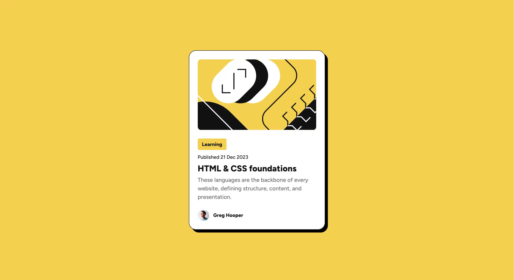
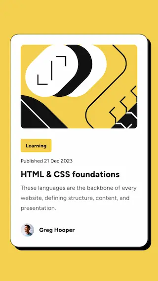

# Frontend Mentor - Blog preview card solution

This is my solution to the [Blog preview card challenge on Frontend Mentor](https://www.frontendmentor.io/challenges/blog-preview-card-ckPaj01IcS). Frontend Mentor challenges help you improve your coding skills by building realistic projects.

## Table of contents

- [Overview](#overview)
  - [The challenge](#the-challenge)
  - [Screenshot](#screenshot)
  - [Links](#links)
- [My process](#my-process)
  - [Built with](#built-with)
  - [What I learned](#what-i-learned)
  - [Continued development](#continued-development)
  - [Useful resources](#useful-resources)
- [Author](#author)

## Overview

### The challenge

Users should be able to:

- See hover and focus states for all interactive elements on the page

### Screenshot

Desktop view:

Mobile view:

### Links

- Solution repo: [You're already here!](https://github.com/kalwilson/fem-blog-preview-card)
- Live Site: [Click Here](https://kalwilson.github.io/fem-blog-preview-card/)

## My process

### Built with

- Semantic HTML5 markup
- CSS custom properties
- Flexbox
- Fluid typography utilizing clamp
- BEM naming methodology

### What I learned

- Practiced utilizing clamp for fluid typography
- Using the time tag with pubdate

### Continued development

- Review clamp a bit more to use it in other instances.

### Useful resources

- [Bruce Lawson's Personal Site](https://brucelawson.co.uk/2012/best-of-time/) - This was a great bit of info on the time tag and how to use it.

## Author

- GitHub - [Kal Wilson](https://github.com/kalwilson)
- Frontend Mentor - [@kalwilson](https://www.frontendmentor.io/profile/kalwilson)
- LinkedIn - [Kal Wilson](https://www.linkedin.com/in/kalwilson)
